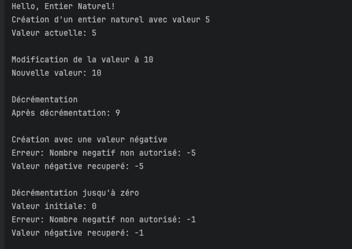

# Programmation Orientée Objet Java - Base de la Gestion des exceptions

# Exemple 2: Gestion des Comptes Bancaire

## Exceptions:

- FondsInsuffisantsException
- CompteInexistantException.
- MontantSuperieurZeroException

## Application: `src/CompteBancaire` (Package)

   

### Ajouter des comptes

#### 1. Ajouter un compte courant

#### 2. Ajouter un compte d'epargne

#### 3. Dépôt d'argent sur un compte:
   - `cas passant`
    
   
    
  - `Cas fonds du compote source insuffisant`

    

  - `cas du compte qui n'existe pas`

    

  - `cas d'un montant négatif ou 0`

    

#### 4. Afficher la liste des comptes

#### 5. Retrait d'argent sur un compte
   
   - `cas passant`

   

  - `cas du compte qui n'existe pas`

    

#### 6. Affichage du solde du compte

#### 7. Transfert d'argent entre deux comptes.
   - `cas passant`

   

  - `Cas fonds du compote source insuffisant`

    

  - `cas du compte source qui n'existe pas`

    

  - `cas du compte destination qui n'existe pas`

    

  - `cas d'un montant négatif ou 0`

    

#### 8. Supprimer un compte.
   - `Suppression`

   

   - `Verification`

   

#### 9. Quitter

#### 10. Option non existant

    

# Exemple 1: Entier Naturel

## Gestion des exceptions
## Exceptions:

- NombreNegatifException

## Application: `src/EntierNaturel` (Package)
